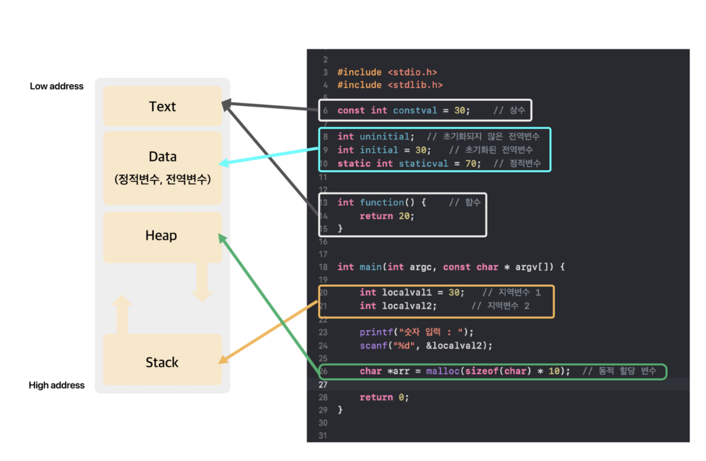

/* 21-10-24 */

프로세스 : 현재 컴퓨터가 실행하고 있는 프로그램

1. 프로세스는 독립된 메모리 영역을 할당 받는다.(프로세스당 메모리 구조가 하나씩 할당됨)
   
    [메모리 구조]
    1. Code(text) : 코드를 실행하기 위해 저장되어있는 영역, 프로그램을 실행시키기 위해 구성되는 것들이 저장된다.
       한마디로 명령문들이 저장되는 것이며 제어문, 함수, 상수들이 이 영역에 저장된다.
       
    2. Data : 전역변수, 정적변수 등이 저장된다. 프로그램 실행전에 선언되어(메인함수) 프로그램이 끝날때까지 메모리에 남아있는 변수들이다.
       
    3. Heap : 사용자에 의해 관리되는 영역(동적으로 할당 할 변수들이 여기에 저장된다.)
       
    4. Stack : 지역번수, 매개변수들이 저장되는 공간이다. 함수가 종료되면 할당된 변수들을 메모리에서 해제시킨다.

   
2. 프로세스는 커널에 의해 관리되며 Ready, blocked, running 등 상태가 있다.
   
    * new -> ready
      new 상태에서 프로세스가 생성되게 되면 OS 커널에 존재하는 Ready Queue에 올라가게 된다.
    * ready -> running
       Ready Queue에 있는 프로세스들을 OS가 프로세스 스케쥴링 알고리즘에 의해 Running 상태로 가야할 프로세스를 CPU로 할당한다. 
    * running -> ready
       현재 Running 상태에 있는 프로세스 A보다 Ready Queue 에서 대기하고 있는 프로세스 B가 우선순위가 높으면(하단의 프로세스 스케쥴링에 의해 결정됨),
       Primitive schedule인경우 Ready 가 되고, B가 Running 상태가 되어 CPU 할당 받게 됨
    * running -> blocked 
      현재 러닝상태에 있는 프로세스 에서 입출력 이벤트가 발생했을때 blocked이 됨
    * blocked -> ready
      입출력 이벤트가 종료된 프로세스는 다시 Ready 상태가 됨
      

3. 프로세스 스케쥴링(CPU에 할당되는 순서 및 방법을 결정하는 일.)
    
    * 멀티 프로세스 환경에서 하나의 CPU가 복수의 프로세스를 실행하기 위해선 스케쥴링이 필요하다.
      윈도우, 리눅스 맥 등 대부분의 OS에서 우선 순위 스케쥴링 + 라운드-로빈 스케쥴링 알고리즘을 혼합한 방법을 사용한다.
      
    * 우선 순위 스케쥴링(Priority Scheduling Algorithm)
       각각의 프로세스 마다 우선순위를 부여해서 우선순위가 높은 프로세스를 먼저 실행시키는 알고리즘
      
    * 라운드-로빈 스케쥴링(Round-Robin Scheduling Algorithm)
       우선 순위 스케쥴링 방식의 예외를 처리하기 위해 고안된 알고리즘(같은 우선 순위의 프로세스 간에는 어떻게 CPU를 분배할 것인가)
       -> 정해진 시간 간격(Time Slice, Quantum) 만큼만 실행을 하고, 우선 순위가 동일한 다른 프로세스에게 CPU의 할당을 넘기는 방식이다.
        따라서, 중요한 것은 Time Slice를 얼마나 길게 가져갈 것인지 결정하는 것인데
        1) 길면 인터랙티브한 시스템에서 문제가 발생할 수 있다.(입력에 대한 반응이 늦어짐)
        2) 너무 짧으면 Context Switching이 많이 발생해서 성능 저하 문제가 심각해 진다.
        ☺︎ 최근 OS들은 15~20ms 간격으로 스케쥴링을 수행한다.

    * 프로세스 스케쥴링 발생 시점
        1) Every Time Slice
        동일 우선 순위의 다른 프로세스에게 CPU를 넘겨줘야 하는지 판단을 위해 타임슬라이스마다 스케쥴러가 동작해야 함.
        2) 프로세스의 생성과 소멸
        우선 순위가 가장 높은 프로세서가 CPU차지해야 하므로,
        새로운 프로세스가 생성되었을때, 현재 실행되고 있는 프로세스보다 더 높은 우선순위의 프로세스인지 확인해야하고,
        프로세스가 종료되었을때, 우선순위가 더 높았던 프로세스인지 확인해야 한다.
        3) 실행중인 프로세스가 블로킹 되었을때
        현재 프로세스가 I/O 등으로 블락킹 되었을때 다른 프로세스가 대신 실행되어야 하고,어떤 프로세스가 가장 우선순위가 높은지
        확인하기 위해 스케쥴링이 발생 해야 한다.

4. Context Switching(실행되고 있는 프로세스가 바뀌는 것)
    
    *멀티프로세스 환경에서 CPU가 어떤 하나의 프로세스를 실행하고 있는 상태에서,
     인터럽트 요청에 의해 다음 우선 순위의 프로세스가 실행되어야 할 때
     기존의 프로세스의 상태 또는 레지스터 값(Context)을 저장하고 CPU가 다음 프로세스를 수행하도록
     새로운 프로세스의 상태 또는 레지스터 값(Context)를 교체하는 작업을 Context Switch(Context Switching)라고 한다.

    * OS의 Context는 CPU가 해당 프로세스를 실행하기 위한 해당 프로세스들의 정보다.
      Context는 PCB에 저장된다.
      [PCB의 저장정보]
      * PCB는 운영체제가 프로세스 스케쥴링을 위해 프로세스에 관한 모든 정보를 가지고 있는 구조체이다.
      * 각 프로세스가 생성될 때마다 고유의 PCB가 생성되고, 주기억장치에 유지된다.
      1) PID: 프로세서 고유 번호
      2) 상태: ready, running, wait 등
      3) 포인터 : 다음 실행될 프로세스의 포인터
      4) 레지스터 : 레지스터 관련 정보
      5) 우선순위 : 스케쥴링 및 프로세스 우선 수누이
      6) 할당된 자원 정보
      7) Account :  CPU 사용 시간, 실제 사용된 시간
    
    * Context Switching 시, Context Switching 을 수행하는 CPU 는 Cache 를 초기화하고 Memory Mapping 을 초기화하는 작업을 거치는 등 아무 작업도 하지 못하므로
      잦은 Context Switching 은 성능 저하를 가져온다.(아무 작업도 못하는 상황을 OverHead 라고도 한다.)
      

